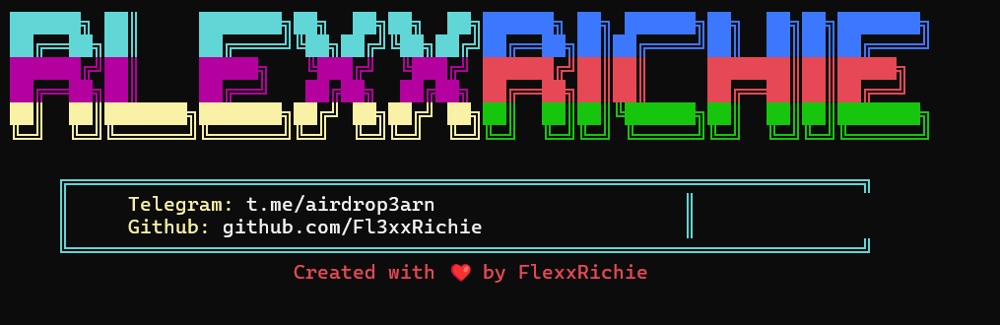

# MatchQuest Bot

💡



[](https://t.me/airdrop3arn)
[](https://github.com/Fl3xxRichie)

An automated bot for MatchQuest tasks and farming.

## 📋 Prerequisites

- Python 3.8 or higher
- Git
- Internet connection
- Telegram account

## 🔧 Installation Instructions

### Windows

1. Install Python:
   ```bash
   # Download Python from official website
   https://www.python.org/downloads/
   # Make sure to check "Add Python to PATH" during installation
   ```

2. Install Git:
   ```bash
   # Download Git from official website
   https://git-scm.com/download/windows
   ```

3. Clone and Setup:
   ```bash
   # Open Command Prompt and run:
   git clone https://github.com/Fl3xxRichie/matchquest.git
   cd matchquest
   pip install -r requirements.txt
   ```

### Linux

1. Update System:
   ```bash
   sudo apt update && sudo apt upgrade -y
   ```

2. Install Prerequisites:
   ```bash
   sudo apt install python3 python3-pip git -y
   ```

3. Clone and Setup:
   ```bash
   git clone https://github.com/Fl3xxRichie/matchquest.git
   cd matchquest
   pip3 install -r requirements.txt
   ```

### Termux (Android)

1. Update Termux:
   ```bash
   pkg update && pkg upgrade -y
   ```

2. Install Prerequisites:
   ```bash
   pkg install python git -y
   ```

3. Clone and Setup:
   ```bash
   git clone https://github.com/Fl3xxRichie/matchquest.git
   cd matchquest
   pip install -r requirements.txt
   ```

## 🚀 Usage

1. Join MatchQuest Bot:
   ```
   https://t.me/MatchQuestBot/start?startapp=040d4e0c3f6a38f620f98c1ba8d92b12
   ```

2. Get Login Parameters:
   - Click "Connect Wallet"
   - Copy the generated URL parameters

3. Create queries.txt:
   ```bash
   # Create a file named queries.txt
   # Paste your login parameters into this file
   ```

4. Run the Bot:
   ```bash
   python app.py
   # or
   python3 app.py
   ```

## 📱 Multiple Account Management

1. Split Queries:
   - Choose option 1 when starting the bot
   - Enter number of accounts per terminal
   - Bot will automatically split queries.txt into multiple files

2. Use Existing Files:
   - Choose option 2 to use previously split files
   - Select the specific queries file to use

3. Single File:
   - Choose option 3 to use queries.txt without splitting

## ⚠️ Important Notes

- Ensure stable internet connection
- Keep login parameters secure
- One instance per terminal recommended
- Don't share your login credentials

## 🤝 Support

- Telegram Channel: [t.me/airdrop3arn](https://t.me/airdrop3arn)
- GitHub Issues: [Report Here](https://github.com/Fl3xxRichie/matchquest/issues)

## 📜 License

This project is licensed under the MIT License - see the [LICENSE](LICENSE) file for details.

## 🙏 Credits

Created with ❤️ by FlexxRichie